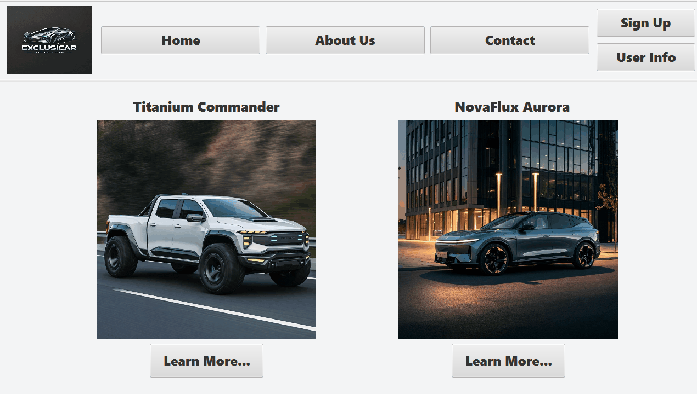

ExclusiCar Rentals. is our CS112 Final project!

This program is meant to represent a user interface for a car rental company that is set 1000 years into the future.

The buttons at the top are used as directions to view different pages of the program. The top right has a login button that is designated for storing the user’s information, DL#, and age to verify that they are eligible to rent a car. Other pages display company information, contact information, and vehicle information so that the user can make an informed decision about their rental. All of this data is stored within the classes and subclasses for easy recall from the controllers and main script.

Our inspiration was somewhat random, but we are very happy with the end result.

UML from UD1: 

UML for UD3: 

GUI Wireframe from UD2: [Wireframe (UD2).pptx](src/main/resources/edu/miracosta/cs112/finalproject/finalproject/Wireframe%20%28UD2%29.pptx)

GUI Wireframe for UD3: [Wireframe (UD3).pptx](src/main/resources/edu/miracosta/cs112/finalproject/finalproject/Wireframe%20%28UD3%29.pptx)

